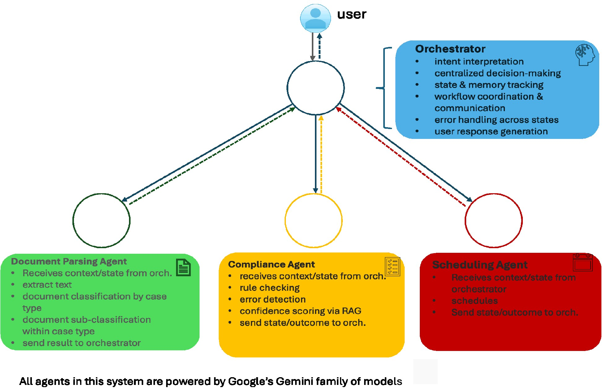

## Agentic Workflow Architecture

**Model Compression & Quantization**

```python
    local_optimization_pipeline = {
        'quantization': 'Quantization to 8-bit integer precision, with minimal impact on task performance.',
        'pruning': 'Structured pruning that preserves domain-relevant attention heads and neuron groups',
        'PEFT': 'Parameter-efficient fine-tuning techniques such as LoRA for efficient legal domain adaptation using low-rank parameter updates',
        'hardware_acceleration': 'Custom ASIC integration for inference',
        'memory_optimization': 'Gradient checkpointing for 16GB RAM deployment'
    }
```

**Multi-Agent System Design**

